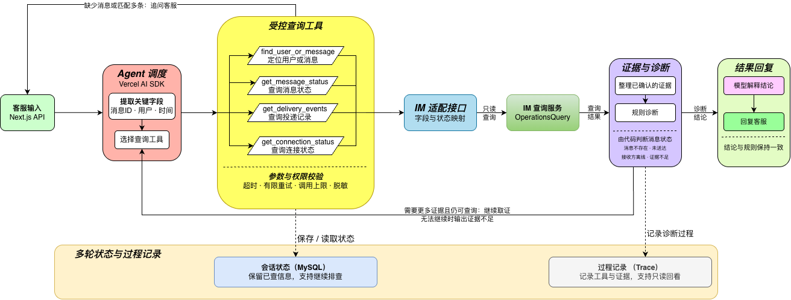

# IM Inspect Agent 全链路图

> 该图展示一次“消息未收到”诊断请求的受控混合循环。模型负责理解问题、追问和选择下一步，代码负责校验、执行、聚合事实和最终分类。

图中主链路是：客服输入 → Agent 提取信息并选择工具 → 受控只读查询 → IM 适配接口 → Go IM `OperationsQuery` 查询服务 → 证据整理与确定性诊断 → 结果回复。缺少信息时回问客服；证据不足但仍有可用查询能力时回到工具选择继续取证；超过调用预算、工具失败或能力不支持时安全停止。

`create_escalation_draft` 属于诊断完成后的升级旁路，不进入普通只读查询循环。它需要服务端校验、权限、人工确认和幂等控制；当前全链路图为了突出诊断主线没有展开该旁路。

## 关键控制点

1. **候选字段不等于事实**：LLM 从客服文字中提取的 `messageId` 只能作为工具参数候选；只有 Connector 成功返回并通过 Schema、关联 ID 和权限校验后，才能进入诊断输入。
2. **工具错误不等于业务结论**：超时、权限不足和下游不可用必须原样保留为 `toolError`，不能改写成“消息不存在”或“投递失败”。
3. **最终分类由代码决定**：`diagnose()` 根据 Canonical Model 和证据优先级返回分类，模型只能解释该结果。
4. **写操作单独受控**：模型不能自行提交事故；`create_escalation_draft` 需要服务端确认、权限、内容哈希和幂等键。
5. **循环有硬上限**：达到最大步骤、最大工具调用次数或 deadline 时停止，并返回 `insufficient_data` 或明确的工具错误。
