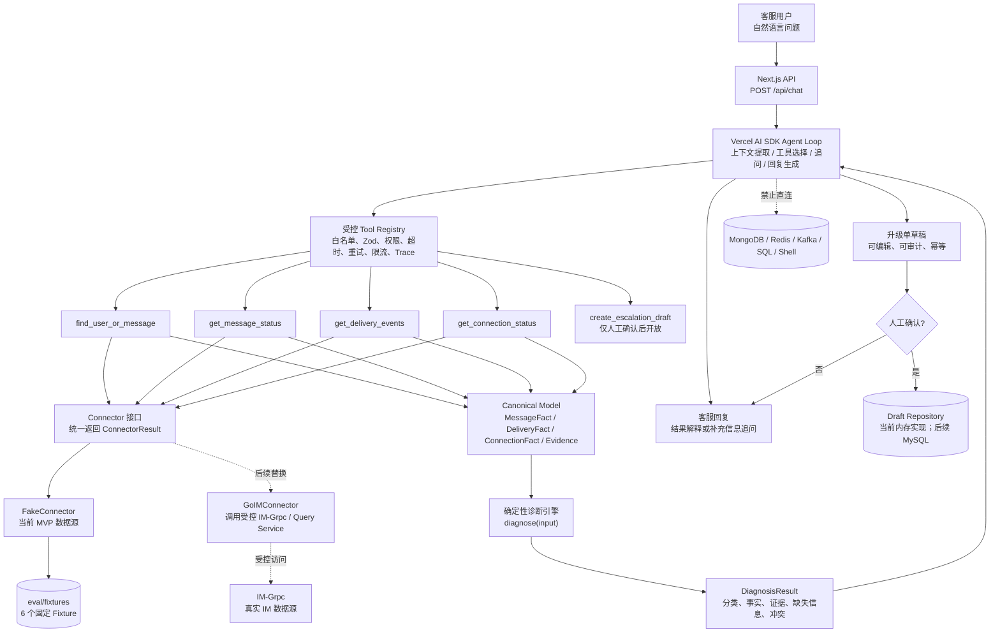

# IM Inspect MVP 架构图

> 该图描述第一版的目标边界。当前开发环境使用 `FakeConnector + 固定 Fixture`，后续可替换为 `GoIMConnector`；两者都必须实现同一个 `Connector` 接口。

## 分层职责

| 层 | 负责什么 | 不负责什么 |
| --- | --- | --- |
| Next.js API | 接收请求、创建服务端上下文、返回结构化结果 | 不直接查询 IM 数据库 |
| Agent Loop | 提取候选字段、选择白名单工具、追问、解释结果 | 不决定数据库事实、最终分类或权限 |
| Tool Registry | 参数校验、鉴权、超时、重试、限流、脱敏和 Trace | 不执行任意 SQL/Shell |
| Connector | 访问具体 IM 的受控接口并映射为 Canonical Model | 不进行最终根因分类 |
| Canonical Model | 表达跨 IM 通用的消息、投递、连接事实和证据 | 不复制某个 IM 的表结构 |
| 诊断引擎 | 根据已确认事实确定性分类 | 不调用 LLM、不访问外部数据源 |
| Draft Repository | 保存升级草稿并执行幂等检查 | 不提交事故、不自动重发消息 |

## MVP 边界

- 一个角色：客服。
- 一个核心工作流：诊断“消息发出但对方未收到”。
- 五个白名单工具，其中只有 `create_escalation_draft` 是写操作。
- 一个开发数据源：固定 Fixture；不声称代表生产数据。
- 一个确定性诊断引擎；LLM 只参与编排和自然语言表达。
- 不做多 Agent、自动重发、修改消息、踢用户、任意 SQL、任意 Shell 或直接提交事故。
